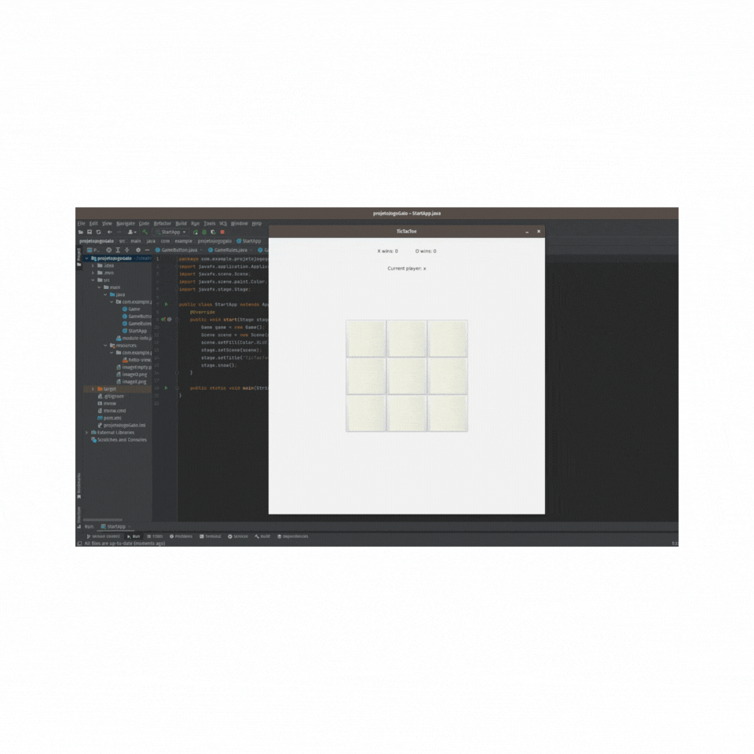

# tictactoe
tictactoe with Java.
This code was made in intelliJ IDEA. This way I could set a stage where I can set my objects and have a graphic interface.
Even tho I'm using java-fx for my objects I don't do any XML configurations or changes.

